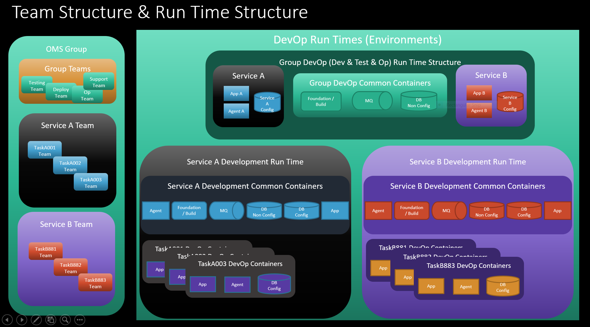

# OMS V10 CICD Design

This design is the reference CICD process for OMS v10 on OpenShift® platform.

This design focuses on the following objectives (design goals):

1. Continuous or near continuous development and deployment of functionalities
2. Modularization of OMS functionalities by Service and Service Delivery team
3. Near continous integration of functionalities from a group of OMS Service delivery teams
4. Operational efficiency and resilience

## Where to start?

[OMS DevOps Process Using Openshift Features](./OMS%20DevOps%20Process%20Using%20Openshift%20Features.pptx) provides the overview of the DevOp process. 

## Design requirements

### Requirements

1. As a deployer: I need to be able to deploy a specific Sterling API with its own configuration and codebase as a microservice 
2. As a deployer: I need to be able to deploy a specific Sterling API(functionality) as a microservice 
3. As a service User: I should not need to be aware of the exact physical (number of containers) location of the microservices 
4. As an infrastructure owner : I would like to minimise operations cost by optimising the number of containers for the given load for each service 
5. As a service user : No lag for response time or throughput time on 99% of service calls
  * Refine the scope of this req to what is relevant

6. As a deployer : I need to have a hard ceiling on resources allocated for each service 
7. As a infrastructure Provider : I need to have a hard ceiling on hardware resources allocated for this instance of OpenShift 
8. Deployer, Infrastructure Provider : <blue-green deployment> 

### Client Ask

1. I need to deploy Sterling's WS (reserve, getOrderList...) as single containers: Can i make a single container with just those API? Can i create as many app server containers as API i have and redirect traffic with a proxy (istio or whatever service mesh is in place) so that each container just receives the payload for that API?

   1. Realtime synchronized micro service runtime
   1. Service discovery
   1. Service routing
   
1. I need to auto-scale based on load (both increase and decrease)

   1. Auto-scale of real-time services
   1. Auto-scale of async services

3. I would like to test a blue-green deployment

   1. Blue-green deployment on same transaction data store (There will be some limitation on this due to entity deployment that you are aware)

4. Deploy a complete Test environment (App + Agent + DB + MQ)

   1. Full instance provision
   1. Partial instance provision (maybe reuse DB and/or MQ)

5. How to build the docker images based on Helm charts

   1. This is probably more as collaboration as demo
